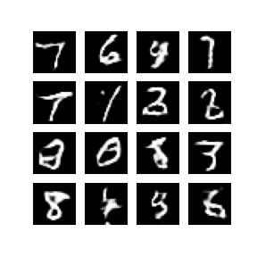
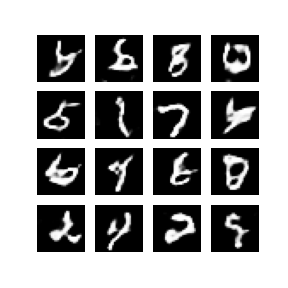

# dcgan-walkthrough

A gentle introduction to generative modeling using a deep convolutional generative adversarial network (DCGAN).   DCGAN is applied to the MNIST dataset.    

## Generated images during model training 

## Examples of generated images from final model  

The walkthrough closely follows the tutorials in tensorflow docs.  

