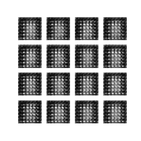

# generative modeling

A gentle introduction to generative modeling using a variational autoencoders and deep convolutional generative adversarial network (DCGAN).   Both are applied to the MNIST dataset.    

---
## Generated images produced by the VAE 

---
## Generated images during model training for DCGAN  

## Examples of generated images from final model  

The walkthrough closely follows the tutorials in tensorflow docs.  

